# SLAMon Getting Started Guide

##1. Introduction

SLAMon stands for SLA Monitor. It is a system for monitoring cloud services and their live performance. Cloud services often consists of multiple subsystems interacting with one another. Monitoring these subsystems individually may provide an inaccurate picture of the current health of the cloud service because they will not be able to catch scenarios where an interface between the subsystems breaks down (Figure 1).

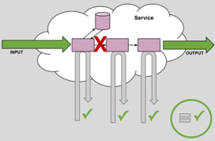

Figure 1: Individual monitoring of subsystems in a cloud service

SLAMon performs end-to-end monitoring of cloud services (Figure 2). This way, SLAMon is able to catch any problems within the cloud that is affecting the service as a whole.

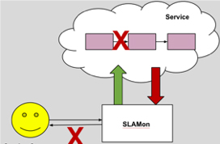

Figure 2: End-to-end monitoring of a cloud service

##2. SLAMon Graphical User Interface

SLAMon uses the JBoss Business Process Management Suite (jBPM) as its graphical user interface (GUI). jBPM allows process owners to create processes using graphical notations and then execute them. An advantage of using jBPM is that it supports Business Process Model Notation (BPMN) version 2, which is the de-facto standard for business process modeling.

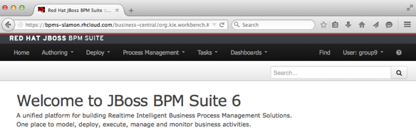

Figure 3: Home screen of jBPM Business Central

After logging in, you will be brought to the home screen of Business Central (Figure 3) - the main user interface of jBPM. You can find the main menu at the top of the page. It consists of the following submenus:

+ Home - brings you to the home screen of Business Central (Figure 3)

+ **Authoring** - this is where you will find the menus for creating and building SLAMon test processes. A SLAMon test process is basically a jBPM business process.

+ Deploy - this is where you will find the menus for deploying jBPM projects containing your SLAMon test processes. Deployment is usually done automatically when you build the jBPM project containing your SLAMon test processes.

+ **Process Management** - this is where you will find the menus for executing and monitoring your SLAMon test processes.

+ Task - this is where you will find the forms for user tasks inputs. User tasks are tasks that need to be performed manually by humans. Since SLAMon is a monitoring system, having a user tasks defeats its purpose therefore SLAMon does not have much use for this jBPM functionality. However, nothing is preventing SLAMon users from using this jBPM functionality should they find it necessary.

+ **Dashboards** - brings you to the jBPM Dashbuilder page. Dashbuilder is the jBPM component that allows non-technical users to visually create business dashboards and interactive reports.

##3. Setting up the environment before creating a process

To demonstrate how to use SLAMon, the succeeding sections of this document will instruct you to create a sample SLAMon test process that checks the status of a website. After that, you will be instructed on how to build, deploy and execute the SLAMon test process you have just created.

As mentioned earlier, a SLAMon test process is just a jBPM business process. Therefore to create one, you need to already have a jBPM project. For a general overview of the structure of the jBPM framework, please refer to the **Model** tab in the **Home** screen of Business Central.

To create a jBPM project, do the following:

1. Go to Authoring → Project Authoring.

2. In the Project Explorer view (Figure 4) on the left, select your organizational unit (e.g. myorg) and repository (e.g. myrepo): this defines the location where you will create your jBPM project.

	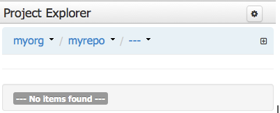

	Figure 4: Project Explorer view

3. 	On the perspective menu (Figure 5), go to New Item → Project
	
	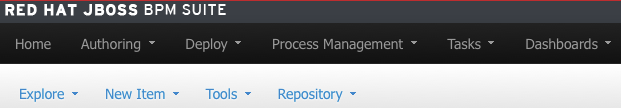
	Figure 5: Perspective menu just below the main menu
4. In the displayed **Create new** dialog box, define myproject as the resource name (the jBPM project name).
5. In the **New Project** Wizard dialog, define the maven properties of the jBPM project and click Finish.

	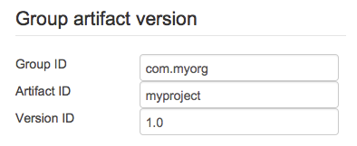
	
	Figure 6: Snippet of the New Project Wizard and sample values
6. Setup the custom work items of SLAMon in your jBPM project. The steps are documented in the installation instruction of the jbpm module of SLAMon. It is currently found in the following link:
 
 <https://github.com/Brownies/SLAMon-Rebase/tree/master/java/jbpm>

##4. Creating a SLAMon Test Process

To create a new SLAMon test process, do the following:

1. Go to **Authoring → Project Authoring**.

2. In the Project Explorer view on the left, select the **myproject** project that you have created in the previous section from your organizational unit (e.g. **myorg**) and repository (e.g. **myrepo**). Make sure you also select the correct package (e.g. **com.myorg.myproject**).
	
	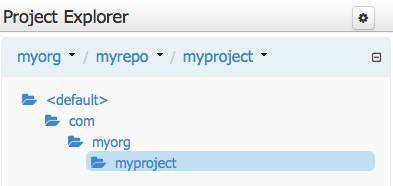
	
	Figure 7: The com.myorg.myproject package as shown in the Project Explorer

3. On the perspective menu, click **New Item** → **Business Process**

4. In the displayed **Create new** dialog box, define **CheckUrlStatus** as the resource name and click **OK**. The resource name here is like a filename of the SLAMon test process in the jBPM repository. This is not to be confused with the actual SLAMon test process name, which is defined in the property of the process (Section 5 step 2).

The Process Designer with the canvas of the created Process definition opens (Figure 9).

##5. Modelling a SLAMon Test Process

After you have created the Business Process definition for your SLAMon test process, you can design the flow in the Business Process designer: The Business Process designer should be open in a tab on the right. If not, click **CheckUrlStatus** under **Business Processes** to open it. Make sure you have selected the correct package (e.g. **com.myorg.myproject**).

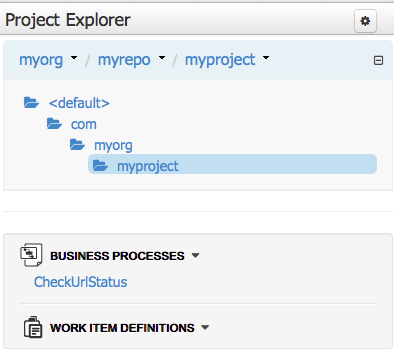

Figure 8: Project Explorer showing the CheckUrlStatus process

As mentioned in section 3, you will be instructed to create a sample SLAMon test process that checks the status of a website. The following summarizes the process that you are going to create:

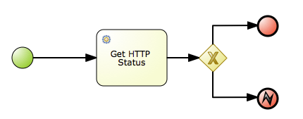

Figure 9: The Process Designer canvas showing the test process to be created

To design the Process content, do the following:

1. Expand the **Properties*' tab: click the double-arrow button () in the upper right hand corner of the Business Process designer tab.

2. Click anywhere on the canvas. The **Properties** tab displays the properties of the **CheckUrlStatus** Process. Enter '**Check status of my website**' as the value for the Process Name property. This will be the actual name of the SLAMon test process.

3. Expand the **Object Library** palette with Process Elements: click the double-arrow button () in the upper left hand corner of the Business Process designer tab.

4. There should already be a Start Event element on the canvas by default. 

5. Create a Generate File Task element: from the palette, drag-and-drop **Get HTTP Status** (under **Service Tasks**)

6. Select the Start Event element: the quick linker items appear around the node. Click and hold the Edge () icon, then drag it to the Get HTTP Status Task element to connect the 2 elements together.

7. Using the quick linker feature, click the Gateway () icon to create an outgoing Sequence Flow to a Data-based Exclusive Gateway element from the Get HTTP Status Task element. Here, the Data-based Exclusive Gateway element represents a choice point in case the Get HTTP Status Task Task returned an incorrect value. This condition will be covered more in Section 6 step 5.

8. Using the quick linker feature of the Data-based Exclusive Gateway element, click the End () icon to create an outgoing Sequence Flow to an End Event element.

9. In the Property tab of the Data-based Exclusive Gateway element, click the drop-down () icon of the Default gate property and select the only option provided. It will be some value that looks like the one shown in Figure 10.

	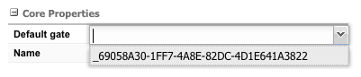
	
	Figure 10: Default gate property of the Data-based Exclusive Gateway element

10. Use the quick linker feature of the End Event element to change it to an Error node: click the Morph shape () icon then select Error.

11. In the Property tab of the Error node, set a value (e.g. 400) for the ErrorRef property.

12. Create another End Event element just like in step 8. This time however, do not change it to an Error node.

13. Your canvas should look like the one shown in Figure 9 at this stage.

##6. Variables in a SLAMon Test Process
Now that you have your SLAMon test process, you also need to define variables used to store outputs of one task and serve as inputs of another task.

1. Click anywhere on the canvas. The **Properties** tab displays the properties of the **CheckUrlStatus** Process.
2. Click the drop-down () icon of the Variable Definitions property to open the Editor.
3. Click Add Variable in the upper left hand corner of the Editor and add the following:

	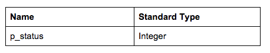

	Take note of the ‘p_’ prefix in the variable names. This is just to avoid 	mistaking them with the tasks variables having the same name. The ‘p’ in the 	prefix stands for process variable.

	Also take note that the standard type of the process variables has to follow 	the standard type of the task variables to whom they will be mapped.

	Take note of the ‘p_’ prefix in the variable names. This is just to avoid 	mistaking them with the tasks variables having the same name. The ‘p’ in the 	prefix stands for process variable.

	Also take note that the standard type of the process variables has to follow 	the standard type of the task variables to whom they will be mapped.

4. Define the following Assignments for the Get HTTP Status Task element:
Assignement Type  From Object Assignment 

	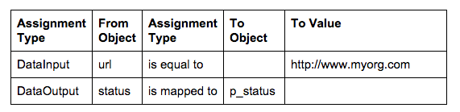
	Here, we store the status returned by the Get HTTP Status Task to the process 	variable. You will need this for the next step.

5. Select the Sequence Flow connecting the Data-based Exclusive Gateway element to the End Even element and set the Expression property to those shown in Figure 11.

	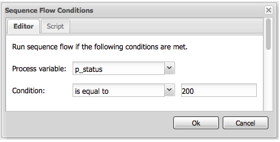
	
	Figure 11: HTTP status code should be 200

6. Save your Process: open the Save menu () and click Save.

7. Building and deploying
At this point, you should have a **CheckUrlStatus** process that is ready to be executed. Before you can execute it on jBPM however, you need to build and deploy the entire jBPM project containing all your SLAMon test processes.

To build a project:

1. On the main menu of Business Central (Figure 3), go to **Authoring** → **Project Authoring**.

2. In the Project Explorer, locate your project (Figure 7).

3. Open the Project in the Project editor: on the perspective menu, click **Tools** → **Project Editor**.

4. Check that the correct Project details are displayed on the **Project Screen** and click the **Build & Deploy** button in the upper right hand corner of the Project Screen view.

A green notification appears in the upper part of the screen informing you that the project has been built and deployed and is available for execution.

To deploy a project:

1. On the main menu of Business Central, go to Deploy → Deployments.

2. Click the New Deployment Unit button in the upper right hand corner of the Deployments Screen view.

3. Fill in the correct project properties. These are the values you have entered in section 3 (Figure 6).

4. Enter the following for the KIE Configurations and click Deploy Unit:

	+ Runtime strategy: **Singleton**

	+ Kie Base Name: **defaultKieBase**

	+ Kie Session Name: **defaultKieSession**

## 8. Executing a SLAMon Test process
To execute the **CheckUrlStatus** process, do the following:

1. Click **Process Management** → **Process Definitions** on the main menu (Figure 3).

2. On the displayed **Process Definitions** tab, locate the '**Check status of my website**' process. You might need to click the **Refresh** button to have the deployment displayed on the list.

3. Click the **Start** () button next to the Process definition entry and in the Form dialog box, click the **Start** button again to confirm that you want to run the process.

